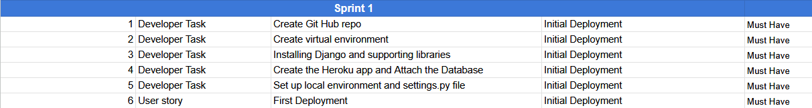

# Agile Methodology

## **Table of Contents**

* [Agile Methodology](#agile-methodology)
  * [Overview](#overview)
  * [Sprint Notes](#sprint-notes)
    * [Sprint 1 Notes](#sprint-1-notes)
    * [Sprint 2 Notes](#sprint-2-notes)
    * [Sprint 3 Notes](#sprint-3-notes)
    * [Sprint 4 Notes](#sprint-4-notes)
    * [Sprint 5 Notes](#sprint-5-notes)
    * [Sprint 6 Notes](#sprint-6-notes)
    * [Sprint 7 Notes](#sprint-7-notes)
    * [Sprint 8 Notes](#sprint-8-notes)

## Overview

I used Google Sheets to make a table to plan out my sprints for this project. I split pretty much all user stories into several epics. I then toggled the priority to represent must-haves, 
should-haves, could-haves, etc. The priority of Each ticket would vary from sprint to sprint in line with an agile methodology ensuring each sprint is focused on the most critical tasks
required to provide the necessary MVP.

## Sprint Notes

Below is a summary of each sprint

### Sprint 1 Notes

The sprint's focus was to get the development environment set up and deployed to Heroku to test in production as early as possible.

### Sprint 2 Notes

This sprint aimed to get the project's coding side up and running. Mainly the ability to view the webpage, the products and the individual product details.

### Sprint 3 Notes

This sprint aims to expand on the last sprint by being able to search for products by category, description etc. I need to make the models to hold the product/category data, upload some
products and then create the views to display the data to the user. This process will include creating the product admin page so I can manually add them to the site.

### Sprint 4 Notes

The sprint aims at sorting products and starting the shopping cart. I had to carry over the ability to search/sort for products due to me not being able to complete that step in the sprint before due to time.

### Sprint 5 Notes

This sprint is aimed primarily at the checkout process and setting up the ability to make payments.

### Sprint 6 Notes

This sprint aims to get the user profile up and running and then add the ability to save the user's address to their profile. Also the ability to leave a review if i had time before i needed to move on, if i didnt i would do it in the next sprint.

### Sprint 7 Notes

With the deadline fast approaching, this sprint aims to focus on the remaining features and bug fixes. This sprint focuses on a few things such as being able to manage the review the user has left by deleting/editing it, the ability to quickly identify deals/special offers etc.

### Sprint 8 Notes

The final sprint is in theory an easy one, this is just for general finishing touches and a few other things such as, being able to contact the store owner and the ability to handle products on the page as a store admin.

[Back to Readme](README.md)