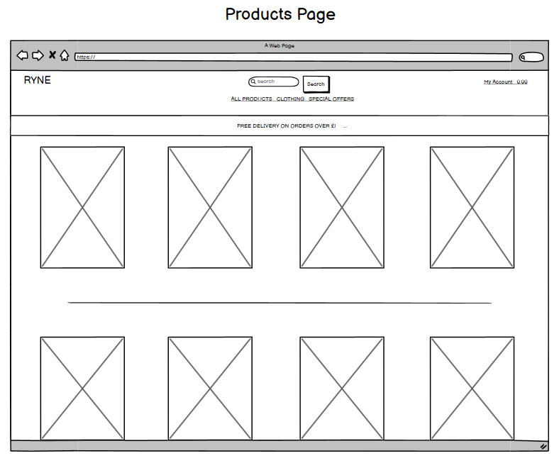
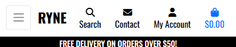
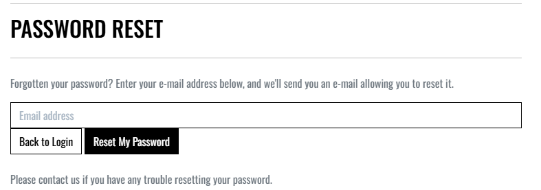
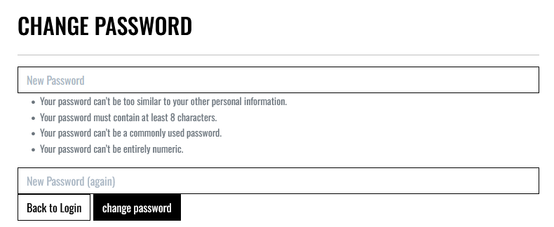
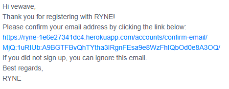

# **RYNE**

RYNE is a fictional gym clothing store that was designed and implemented with Django, Python, HTML and CSS. It aims to provide an easy-to-use interface where customers can browse all items at once or sort into specified categories. The site offers search functionality. Once signed in, users can save an address to their profile for easy and convenient checkout.

The deployed site can be visited here: [RYNE](https://ryne-1e6e27341dc4.herokuapp.com/)

## **Table of Contents**

* [**Planning Phase**](#planning-phase)
  * [**Strategy**](#strategy)
    * [***Site Aims***](#site-aims)
    * [***Opportunities***](#opportunities)
    * [***Scope***](#scope)
    * [***Structure***](#structure)
      * [**User Stories:**](#user-stories)
        * [**EPIC 1 - Set up and Deployment:**](#epic-1---set-up-and-deployment)
        * [**EPIC 2 - Viewing and Navigation:**](#epic-2---viewing-and-navigation)
        * [**EPIC 3 - Sorting and Searching:**](#epic-3---sorting-and-searching)
        * [**EPIC 4 - Registration and User Accounts:**](#epic-4---registration-and-user-accounts)
        * [**EPIC 5 - Purchasing and Checkout:**](#epic-5---purchasing-and-checkout)
        * [**EPIC 6 - Admin and Store Management:**](#epic-6---admin-and-store-management)
        * [**EPIC 7 - Product Reviews:**](#epic-7---product-reviews)
        * [**EPIC 8 - Marketing:**](#epic-8---marketing)
    * [**Skeleton**](#skeleton)
      * [**Wireframes:**](#wireframes)
        * [***Home Page:***](#home-page)
        * [***Products Page:***](#products-page)
        * [***Product Details Page:***](#product-details-page)
        * [***Shopping Cart Page:***](#shopping-cart-page)
        * [***Checkout Page:***](#checkout-page)
        * [***Profile Page:***](#profile-page)
        * [***Newsletter Signup Page:***](#newsletter-signup-page)
        * [***Contact Us Page:***](#contact-us-page)
      * [**Database Schema**](#database-schema)
      * [**SEO considerations**](#seo-considerations)
        * [***Keywords***](#keywords)
        * [***Page Titles***](#page-titles)
        * [***Robots.txt and sitemap.xml***](#robotstxt-and-sitemapxml)
      * [**Content**](#content)
      * [**Surface**](#surface)
        * [***Colour Scheme***](#colour-scheme)
        * [***Typography***](#typography)
    * [**Agile Development Process**](#agile-development-process)
    * [**E-commerce Application Type**](#e-commerce-application-type)
    * [**Marketing Strategy**](#marketing-strategy)
  * [**Features**](#features)
    * [**Common to All Pages**](#common-to-all-pages)
      * [**Navbar**](#navbar)
        * [**Overall Appearance**](#overall-appearance)
          * [***Desktop***](#desktop)
          * [***Mobile***](#mobile)
        * [**Common Navbar Features for both Desktop and Mobile**](#common-navbar-features-for-both-desktop-and-mobile)
          * [***Logo***](#logo)
            * [***Desktop***](#desktop-1)
            * [***Mobile***](#mobile-1)
          * [***Search Bar***](#search-bar)
            * [***Desktop***](#desktop-2)
            * [***Mobile***](#mobile-2)
        * [**Account menu**](#account-menu)
          * [***Unauthenticated***](#unauthenticated)
          * [***Authenticated***](#authenticated)
        * [**Cart icon**](#cart-icon)
        * [**Common Features to both Desktop and Mobile**](#common-features-to-both-desktop-and-mobile)
          * [***Social Media Links***](#social-media-links)
          * [***Newsletter Sign Up***](#newsletter-sign-up)
      * [**Notifications**](#notifications)
    * [**Page content**](#page-content)
      * [**Home Page**](#home-page-1)
      * [**Products Page**](#products-page-1)
      * [**Product Details Page**](#product-details-page-1)
      * [**Reviews**](#reviews)
        * [***Unauthenticated***](#unauthenticated-1)
        * [***Authenticated***](#authenticated-1)
      * [**Edit product - frontend form**](#edit-product---frontend-form)
      * [**Shopping Cart**](#shopping-cart)
        * [***Desktop***](#desktop-4)
        * [***Mobile***](#mobile-4)
      * [**Checkout**](#checkout)
        * [***Desktop***](#desktop-5)
        * [***Mobile***](#mobile-5)
      * [**Checkout Success**](#checkout-success)
      * [**Profile**](#profile)
      * [***Contact us***](#contact-us)
      * [**Authentication**](#authentication)
      * [**Responsive Design**](#responsive-design)
    * [**Admin Panel for Shop Administration**](#admin-panel-for-shop-administration)
      * [**Admin Panel Overview**](#admin-panel-overview)
        * [***Products***](#products)
        * [**Messages**](#messages)
        * [**Orders**](#orders)
        * [**Reviews**](#reviews)
      * [**Future Features**](#future-features)
        * [***Stock system***](#stock-system)
        * [***Sales reports***](#sales-reports)
        * [***Additional shipping choices***](#additional-shipping-choices)
        * [***Additional payment methods***](#additional-payment-methods)
        * [***Additional user account features***](#additional-user-account-features)
        * [***Product options***](#product-options)
        * [***Ticketing Sytem***](#ticketing-sytem)
        * [***Currency***](#currency)
    * [**Testing Phase**](#testing-phase)
    * [**Deployment**](#deployment)
    * [**Technologies used**](#technologies-used)
    * [**Honorable Mentions**](#honorable-mentions)
    * [**Credits**](#credits)

# **Planning Phase**

## **Strategy**

### ***Site Aims***

The aim of the RYNE website is to provide a seamless, user-friendly platform for customers to explore and purchase high-performance gym apparel. It is designed to reflect the brand’s core values and purpose. The site focuses on delivering a smooth shopping experience through easy to follow navigation, responsive design, and secure checkout. Whether users are browsing new arrivals, learning about products, or completing a purchase, RYNE’s digital presence is built to inspire confidence and support fitness goals.

### ***Opportunities***

In the course of providing a fully functioning E-commerce platform, the following opportunities are available: -

Opportunity | Importance | Viability/Feasibility
---|---|---
Mailing list | 5 | 5
Account profile | 5 | 5
Product Filters/searching | 5 | 5
SEO language throughout | 5 | 5
stripe payments | 5 | 5
User feedback for actions taken | 5 | 5
Check out system | 5 | 5
Guest checkout completion | 5 | 5
User login/register | 5 | 5
RYNE blog | 1 | 5
Delivery information | 3 | 5
User Role permissions | 5 | 5
Product reviews | 5 | 3
Full CRUD functionality | 5 | 5
Order History | 5 | 5
Stock management system | 5 | 3 |
Contact form | 3 | 5
Social Media pages | 5 | 5
Special offers | 5 | 5
Password Recovery | 5 | 5
Email confirmation of order | 5 | 5
Related products | 1 | 1
Saved customer details on checkout | 5 | 5
Admin can add/remove products via the front end | 3 | 5
Multiple currencies | 5 | 1
Trustpilot reviews | 5 | 1
Terms and conditions | 3 | 5
Order Status | 2 | 5
Generate sales reports | 5 | 1
Ability to edit order until status set to processing | 1 | 5

Totals | 127 | 130

### ***Scope***

Due to the time given for this project and the required grade criteria, there will need to be further trade-offs in the design/development process. Using the agile methodology, I will review my progress weekly and add, adapt, or remove features as applicable to the project at the review portion after each sprint to ensure my website is delivered fully functional by the deadline: -

To avoid scope creep, I have used the MoSCoW method to divide the above opportunities into the below categories aiding me to prioritize and ensure that I can achieve my goal of a fully functioning MVP by the deadline: -

* To create a minimum functional E-commerce site, UX efforts **must** address these opportunities: -
  * Full CRUD Functionality.
  * User login/register.
  * Checkout system.
  * Account profile.
  * Mailing list.
  * Product Filters/searching.
  * Stripe payments.
  * SEO language throughout.
  * Guest checkout completion.
  * User Role permissions.
  * Order History.
  * Social Media page.
  * Special offers.
  * Password Recovery.
  * Email confirmation of order.
  * User feedback for actions taken.
  * Saved customer details on checkout.

* To enhance the customer experience and increase the sites functionality, UX efforts **should** address these opportunities: -
  * Product reviews.
  * Stock management system.
  * Contact form.
  * Admin can add/remove products via the front end.
  * Delivery information.
  * Terms and conditions.
  * Order Status.

* To increase the sites popularity and customer base, UX efforts **could** address these opportunities: -
  * RYNE Blog.
  * Related products
  * Ability to edit order until status set to processing.

* As they are so far out of the scope of this project, UX efforts **will not** address these opportunities: -
  * Trustpilot reviews.
  * Multiple currencies.
  * Generate sales reports.

### ***Structure***

Using the above as a guide, I have created a flow diagram to help me visualize how the user will navigate through the site. During the agile process, minor tweaks may occur to this pre-planned user journey, but the overall structure will more or less remain the same.

#### **User Stories:**

To assist the AGILE process, I have created several user stories to help me plan and implement the project. These will help me prioritize the features and functionality of the site and ensure that I am delivering a completed project by the deadline. The below user stories are divided into EPICs and will be reviewed and updated after each sprint.

##### **EPIC 1 - Set up and Deployment:**

This epic will be tasks rather than user stories since they will be aimed at me as the developer rather than the user. The below tasks will be completed before the first sprint and will be used to set up the project and ensure that it is deployed to Heroku with the AWS S3 bucket for static files. Some of these were taken/adapted from the Code Institute's sample project, Boutique ado.

* As a **Developer** I can...
  * ...**Create a Git hub repository** so that I can **Store my project files online.**
  * ...**Create a virtual environment on my local machine** so that I can **avoid polluting my machine on a global level.**
  * ...**Install Django and required libraries** so that I can **work with a postgress Database and cloudbased images from my local development IDE.**
  * ...**Set up my local coding environment** so that I can **develop on my local machine and deploy securely without revealing sensitive information.**
  * ...**Create a Heroku app** so that I can **link to the a virtually hosted Postgres database for the deployed site.**
  * ...**Create a new AWS S3 bucket** so that I can **store static files and images securely.**

The only user story in this Epic is related to the initial deployment; this is a user story rather than a task because it directly offers value to the user as opposed to being tasks required to create the project: -

* As a **User**, I can **access a live url** so that I can **use the site on any device**.

##### **EPIC 2 - Viewing and Navigation:**

* As a **Shopper** I want to be able to...
  * ...**Clearly identity the sites purpose upon visiting** so that I can **determine if the site is what I am looking for.**
  * ...**View a list of products** so that I can **select some to purchase.**
  * ...**View individual product details** so that I can **identify the price, description, product rating, product image and available sizes.**
  * ...**Easily view the total of my purchases at any time** so that I can **see and review how much I am spending at any time whilst building an order.**
  * ...**Leave a review** so that I can **share my opinion of a product and leave a star rating.**
  * ...**View reviews of a product** so that I can **see what other people think of a product.**
  * ...**Quickly identify deals, clearance items and special offers** so that I can **take advantage of special savings on products I'd like to purchase.**
  * ...**See a pleasantly styled and easy to navigate site** so that I can **enjoy the experience of using the site.**
  * ...**Easily contact the store owner** so that I can **ask questions about the products or the site.**

##### **EPIC 3 - Sorting and Searching:**

* As a **Shopper** I want to be able to...
  * ...**Sort the list of available products** so that I can **easily identify the best rated, best priced and categorically sorted products.**
  * ...**Search for a product by name or description** so that I can **find a specific product I'd like to purchase.**
  * ...**Sort a specific category of product** so that I can **find the best-priced or best-rated product in a specific category, or sort the products in that category by name.**
  * ...**Easily see what I've searched for and the number of results** so that I can **quickly decide whether the product I want is available.**

##### **EPIC 4 - Registration and User Accounts:**

* As a **Site User** I want to be able to...
  * ...**Easily register for an account** so that I can **save my personal details and view my order history online.**
  * ...**Easily login or logout** so that I can **access my personal account information and protect it from unauthorized viewing on shared devices.**
  * ...**Save my personal details to my profile from the checkout page** so that I **don’t have to enter them every time I make a purchase.**
  * ...**Have a personalized user profile** so that I can **view my personal order history and order confirmations, save my payment information and update information.**
  * ...**Easily recover my password in case I forget it** so that I can **recover access to my account.**
  * ...**Receive an email confirmation after registering** so that I can **verify that my account registration was successful.**
  
##### **EPIC 5 - Purchasing and Checkout:**

* As a **Shopper** I want to be able to...
  * ...**Select a quantity of a product** so that I can **buy the required amount of the product.**
  * ...**View items in my bag to be purchased** so that I can **identify the total cost of my purchase and all items I will recieve.**
  * ...**Adjust the quantity of individual items in my bag** so that I can **easily make changes to my purchase before checkout.**
  * ...**Easily enter my payment information** so that I can **check out quickly and with no hassles.**
  * ...**View an order confirmation after checkout** so that I can **verify that I haven't made any mistakes.**
  * ...**Receive an email confirmation after checking out** so that I can **keep the confirmation of what I've purchased for my records.**
  * ...**View my order history** so that I can **see the orders I have made previously.**
  * ...**Access the checkout page** so that I can **review my order whilst entering my payment/shipping details.**
  * ...**Feel my personal and payment information is safe and secure** so that I can **confidently provide the needed information to make a purchase.**

##### **EPIC 6 - Admin and Store Management:**

* As a **Store Owner** I want to be able to...
  * ...**Add a product** so that I can **add new items to my store.**
  * ...**Edit/update a product** so that I can **change product prices, descriptions, images, and other product criteria.**
  * ...**Delete a product** so that I can **remove items that are no longer for sale.**
  * ...**Manually manage the stock levels** so that I can **input received purchase orders and ensure that the stock levels are accurate in case of discrepancies or damages.**

##### **EPIC 7 - Product Reviews:**

* As a **Shopper** I want to be able to...
  * ...**Leave a review** so that I can **share my opinion of a product and leave a star rating.**
  * ...**View reviews of a product** so that I can **see what other people think of a product.**
  * ...**Edit my reviews of a product** so that I can **update my public opinion should it ever change.**
  * ...**Delete my reviews of a product** so that I can **remove previous reviews should I see fit.**.

##### **EPIC 8 - Marketing:**

* As a **business owner** I want to be able to...
  * ...**Set up a social media page** so that I can **promote my business and products to the global market.**
  * ...**Increase my search engine ranking** so that I can **increase the number of visitors to my site.**
  * ...**Setup a newsletter signup** so that I can **inform the customers with news on products**

### **Skeleton**

#### **Wireframes:**

Wireframes were created using Balsamiq wireframes to visualize how the site would look and function. Included below are the wireframes used to plan the site's layout.

##### ***Home Page:***

Desktop:

Mobile:

##### ***Products Page:***

Desktop:

Mobile:

##### ***Product Details Page:***

Desktop:

Mobile:

##### ***Shopping Cart Page:***

Desktop:

Mobile:

##### ***Checkout Page:***

Desktop:

Mobile:

##### ***Profile Page:***

Desktop:

Mobile:

##### ***Newsletter Signup Page:***

Desktop:

Mobile:

##### ***Contact Us Page:***

Desktop:

Mobile:

### **SEO considerations**

#### ***Keywords***

During the creation of my website I added as many different phrases and keywords to my meta tags to assist in the SEO of the site. This was so my website would be easily searchable and that when users were looking for the products that my website provides they would be taken to my website.

#### ***Page Titles***

Each page shows an extra title after the store name to assist help with SEO.

#### ***Robots.txt and sitemap.xml***

Sitemap and robots.txt files have been added to the site's root to help with SEO.

### ***Content***

The site did not have too many opportunities for content in terms of paragraphs and text. A lot of the keywords are products themselves, so i have tried to use the heading tages and other semantic tags correctly so that the quality of my site's search rating is as high as possible.

### **Surface**

Once the project was planned I then had to decide on a theme. I wanted to keep it simple but have some colour to help it stand out. I also wanted to keep it clean and easy to navigate. I have used a lot of white space and a simple colour scheme to help with this.

#### **Colour Scheme**

The main colours used in this site were Black and White, this was purely for the simplicity of the site. I believe that the simple colour scheme adds to how easy the site is overall to navigate without any complication.

#### ***Typography***

I done some research on fonts to decide which one I wanted to use for this project, in the end I decided on:

* [Oswald](https://fonts.google.com/specimen/Oswald) - This font is used throughout the entire websites due to its clean and easy to read look, it also stands out well.

## **Agile Development Process**

I used a Google Sheets table to track and create issues/user stories. You can find a summary of my agile process/learnings [here](AGILE.md).

## **E-commerce Application Type**

As already mentioned, RYNE is a B2C e-commerce application. Selling directly to consumers means that the site is designed to sell quickly, on impulse and in smaller quantities. Due to this being a B2C website only, a large amount of the functionality is focused on the user experience and the ability to purchase products quickly and effectively.

## **Marketing Strategy**

As RYNE is a start-up business, the budget for marketing is limited compared to other businesses. However, there are several ways that RYNE can market itself to help increase sales and brand awareness. Using Facebook to get out content and drive traffic is the first and most straightforward. The use of paid ads allows the business to target specific demographics and increase brand awareness. The use of social media is also a great way to get feedback from customers and to help with customer service. There is an image of the Facebook page in the features section below and a link to the page [here](https://www.facebook.com/profile.php?id=61577294705720).

The second is the use of google ads which are a great way to increase brand awareness and help with SEO. The use of google ads can also help with the use of long-tail keywords and help with the ranking of the site.

The third is the use of influencers. Influencers are a great way to increase brand awareness. Free samples could be sent to popular athletes, bodybuilders, strongmen etc. on youtube in exchange for a mention/hashtag/link in the description. Further helps raise brand awareness because the video could be posted on Facebook and the influencer tagged in the post, which with the help of the algorithm used at Facebook, would help bring an organic audience to the Facebook page and, hopefully, the store.

# **Features**

## **Common to All Pages**

### **Navbar**

The navigation bar is the core navigation for the site. It differs slightly from mobile to desktop; however, both include all the same components.

#### **Overall Appearance**

##### ***Desktop***

##### ***Mobile***

#### **Common Navbar Features for both Desktop and Mobile**#

##### ***Logo***

The logo/favicon was designed to symbolize the brand. I made it myself using Photopea(https://www.photopea.com/)

##### ***Search Bar***

The search bar slightly changes according to the screen size, this was to prevent it squashing on mobile. On desktop and mobile it is in the center, but the look of it is changed due to screen size, see images below.

###### ***Desktop***

###### ***Mobile***

When the "Search" buttton with the magnifying glass is selected the search box drop down appears.

The user can enter their search term, and the products page will return with any products that match the search term. This function checks the product name and description and the user is then returned with a list of results.

#### **Account menu**

The "My Account" menu is a drop-down menu that appears when the user clicks on the "My Account" icon. The drop-down changes slightly depending on the authentication status of the user. The menu will show the option to register or login if the user is not logged in. If the user is logged in, the menu will show "My Profile", where the user can edit their saved delivery information and see their order history, and "Log Out" which will allow the user to log out.

##### ***Unauthenticated***

##### ***Authenticated***

A normal user will not see "Product Management", this is only for super users.

#### **Cart icon**

The cart icon is visible in the navbar on all pages. The icon indicates the current total of all items in the cart.

A cart preview appears when the user adds an item to the cart. This cart preview relays the success message, gives a scrollable preview of the cart, the current total excluding delivery, and an informative message about how far the user is from the free delivery qualifier.

Clicking the cart icon any time will take the user to the shopping cart page described later.

#### **Common Features to both Desktop and Mobile**

The two sections typical to both desktop and mobile are:

* Social Media Links
* Newsletter Sign Up

##### ***Social Media Links***

I have included only one social media link for Facebook for the purposes of this project as it is the one I would like most to leverage in my marketing strategy. However, should this project ever grow further, it would also be expected to include Twitter and Instagram as a minimum.

The current Facebook link will take the user directly to [Facebook](https://www.facebook.com/profile.php?id=61577294705720) where the shop will share promotions and news about the shop. More will be discussed about this in the marketing section.

I have included screenshots of the Facebook page in case Facebook decides to remove it because it is not a real business at this stage.

##### ***Newsletter Sign Up***

Due to time restrictions i wasnt able to actually create a newsletter use [Mailchimp](https://mailchimp.com/). I created an account and was going to use it but it was right towards the end of my project and due to complication with the payment and the time i had before my deadline i decided to spend my time elsewhere.

### **Notifications**

Similar to the cart preview, the notifications are a small pop-up appearing on the screen's top right. They are used to inform the user of the status of their actions. For example, if the user adds an item to the cart, they will see a notification that says, "Item added to cart.", if the user logs in they will recieve "successfully signed in as (username)" etc. Where ever possible, when the cart preview is not required, the notifications do not include it.

## **Page content**

### **Home Page**

The home page is the first page on which a user lands. For this reason, it has to have a clearly defined purpose and be easy to navigate.

To make the site's purpose immediately apparent, I included a image that clearly showed the site is gym related. I also have a button that is immediately seen saying "Shop Now" which takes the user to the product page.

### **Products Page**

The products page is the main page of the site. It is where the user will go to browse the products and add them to the cart. It is also where users will go when they filter the products by category. On the individual product cards, the user can see the product name, price, category, rating and image. A user accesses the product details by clicking on the product image.

Further to the above, when a user searches for a product and no results are returned, a message is displayed informing them that no results were found.

### **Product Details Page**

Users can access the product details page when they need more information before committing to purchase an item. This page contains all the information the user needs to make an informed decision.

The layout does change a little on a mobile view to improve the appearance.

It is also worth noting that a superuser can see an edit and delete button on the products and product details page to quickly improve certain fields and remove the product altogether should it be required. I decided to leverage the admin panel for most internal business functions; however, I will go into more detail later.

### **Reviews**

The reviews tab was best suited to be on the product details page, making it easy to determine for which product the review was intended. The reviews are displayed in an accordion to save space.

#### ***Unauthenticated***

The user can see all reviews when logged out; however, they cannot leave one. They are taken to the login page to log in or register to leave a review when they select "Leave a review".

#### ***Authenticated***

If the user is logged in when they select "Leave a review" they are taken to a page with a form to fill out to leave a review.

The last thing to mention here is that the review author (and the superuser in case of foul language) can delete or edit the review. Editing/deletion is performed by clicking the delete/edit button in the review body, visible only to them.

### **Edit product - frontend form**

As shown above, the product details page has an edit button for the super user to make a quick edit should they spot a typo or want to change a picture. This button takes the superuser to a form pre-populated with the current product information. The user can then make the changes they require and submit the form. The form is validated on the front and back end, and the user is informed of any errors. The user is then redirected to the product details page.

### **Shopping Cart**

The shopping cart page is where the user can review the items for purchase. The user can also amend the quantity of each item, update and click the update button to update the cart. The user can also remove an item from the cart by clicking the remove button. Once the user is happy with the items in the cart, they can click the secure checkout button to proceed to the checkout page.

#### ***Desktop***

#### ***Mobile***

Lastly, users will see the following message displayed if they try to access the shopping cart with no items.

### **Checkout**

The checkout page is where the user will enter their payment details and shipping address. If the user is logged in with details already saved to their profile from a previous order, then the form will be prefilled with this information. The user can also save their details from the checkout page. The card element is injected by the stripe API and uses a payment system that is fully PCI compliant. The same API also handles any errors using the allocated div to display them to the user. For a list of test card numbers, please see the [stripe documentation.](https://stripe.com/docs/testing). When the form has been submitted, the pay now button converts into a spinner to show it is processing. Further to the spinner, there is a transparent overlay to prevent the user from clicking anything else and creating multiple orders. The page is fully responsive, and the display order changes slightly from mobile to desktop.

#### ***Desktop***

#### ***Mobile***

Guests can also check out, and on the checkout page, they see the following in place of the save info checkbox.

The last stage of the check out if for the user to receive an email like the sample below:

### **Checkout Success**

This page confirms to the user all the details of their order. At the bottom, the user is prompted with a "Now check out the latest deals" button to view items that are in the new arrivals, deals and clearance categories. This page can only be viewed once and has logic on the back end to prevent anyone from returning to it to protect the user's details from anyone who might be able to intercept the order number or be trying random UUIDs with the URL.

### **Profile**

The profile page has a section which is a form for the user to update their default shipping details:

And another section to view the order history:

The order number is truncated to save space, and when the user clicks on it, they are taken to a variation of the checkout success page. The only differences to the original checkout success page is the button at the bottom, which takes the user back to the profile page.

### ***Contact us***

Finally, for the front end, I have created a simple contact form for the user to get in touch. I will discuss in detail shortly how this works from the point of view of replying. However, the form allows a platform for the user to send a message to the shop. The message will then be picked up from the admin panel and responded to via email, as is a standard convention.

### **Authentication**

The user can log in and out using an adapted version of templates from the all-auth library.

 

The user can reset their password via a form:

Then receive an email with a link to reset their password on the store site.

  

Once changed, they will see the following message.

The user can also register for an account using the following form.

And will receive an email to verify their email, preventing spam accounts from being created.

The link in the email brings them to this screen.

And once the email is confirmed, the user is invited to log in with their new account.

### **Responsive Design**

It is worth stating that all pages are fully responsive; however, I have only screenshot the ones with a significant layout change in the screenshots above.

## **Admin Panel for Shop Administration**

I have decided that since Django has such a powerful admin panel built in, I would leverage this to help the daily running of the e-store.

### **Admin Panel Overview**

The admin panel is accessed via the /admin/ URL and is protected by a login.

#### ***Products***

The superuser can view all the products that are currently on the site, the superuser can also edit all details about the product in this page such as the categories the product is in, name, description, whether the product has different sizes or not, price, rating and image.

#### **Messages**

The admin panel is also where the superuser can see any messages sent via the "contact us" form, from this they can get the users email so they can use it to respond to them. In the future, I would have a ticketing system so the admin could reply here too, and make it visible to the customer on the front end.

#### **Orders**

The admin panel is also where the superuser can see any orders placed by customers, including all the information such as full name, email, phone number, delivery location, price, items purchased etc. They also have the option to change details of an item such as size and quantity and the option to add or remove products from the order incase of a user wanting to change anything on the order after it has already been made.

#### **Reviews**

The superuser can also see and edit all reviews on every product from a "Reviews" tab, if need be the superuser can edit or delete these reviews for any reason they see fit.

### **Future Features**

This project was a lot of fun, and although there is a viable MVP, there are many additional features I would like to add in the future.

#### ***Stock System***

My initial thought of implementing a stock system was to be able to input the total stock of a product through the admin panel but after further thought of how this would work I realised it would end up being a long winded process if you had to constantly add remaining stock from an old order onto stock from a new order. After some thought i realised an automatic stock system would work way better where you would input an excel file from the supplier into the admin and have the system automatically add the items to the total stock of the products.

#### ***Sales reports***

We all know that sales reports are necessary in this world of data-driven decision-making. I want to add a feature to the admin panel that allows the admin to generate sales reports for a given period. Accounts would enable the admin to see the store's performance and make decisions based on the data.

#### ***Additional shipping choices***

Such as couriers and recorded mail.

#### ***Additional payment methods***

Such as Paypal, Klarna etc.

#### ***Additional user account features***

Additional user information, such as an extra address, phone number, etc., and an avatar to be displayed when leaving reviews to build a sense of community.

#### ***Product options***

Such as more images per item including linked products and related products. For example, as it is now, there would need to be a product for a black t-shirt and a grey t-shirt. I want to have it so that the admin can add a product option for the colour of a t shirt and have all the other colour options underneath it. This would allow the admin to have one product for mutiple colours, and the customer could select the colour they want. Ideally, this feature would have a field that enables a product to know when another identical product exists, just with a different colour, and automatically link it to one product page with a drop-down.

#### ***Ticketing Sytem***

Users can have a personal inbox when contacting the store regarding their issues.

#### ***Currency***

Users will have the option to change the currency of the site.

## **Testing Phase**

I have included testing details during and post-development in a separate document called [TESTING.md](TESTING.md).

## **Deployment**

The final Deployed site can be found [here](https://ryne-1e6e27341dc4.herokuapp.com/)
I have included details of my initial deployment in a separate document called [DEPLOYMENT.md](DEPLOYMENT.md).

## **Technologies used**

* Python
  * The packages installed for the project can be found in [the requirements.txt](requirements.txt)
* Django
  * Django was used as the python framework in the project.
  * Django all auth was used to handle user authentication and related tasks i.e. sign in, sign up, sign out.
* Heroku
  * Used to deploy the page and make it publicly available.
* Heroku PostgreSQL
  * Used for the database during deployment.
* SQLlite3
	* Was used during development as a database to test models.
* HTML
  * HTML was the base language used to lay out the skeleton of all templates.
* CSS
  * Custom CSS is used to style the page and make the appearance look a little more unique.
* Javascript
  * I have used Javascript to manipulate the DOM and communicate with the backend to create, read, update, and delete data from the database.
* jQuery
  * I have used jQuery to simplify the use of Javascript.
* Bootstrap 5.1.3
  * Used to style HTML, CSS, minor javascript.
* Font awesome
  * All icons throughout the page.
* AWS S3
  * Used to store static and media files.
* Stripe
  * Used to handle payments.

## **Honorable Mentions**

Richard Wells (mentor) - He went above and beyond and helped me massively with any errors i came across.

My family - They have motivated me and pushed me to keep going, even when i am struggling.

My girlfriend - For constantly being supportive of me and giving me the time and space to complete this project.

## **Credits**

* [Code Institute](https://codeinstitute.net/) - For the course material and the support throughout.  Some of the project may reflect similarities to the course material, but I have tried to make it unique.
* Balsamiq was used to create the wireframes.
* The site was developed using VScode.
* GitHub was used to store my repository.
* Responsive screenshot made using [amiresponsive](https://ui.dev/amiresponsive)
* The flowchart was created using [draw.io](https://app.diagrams.net/)
* Fonts were taken from [Google Fonts](https://fonts.google.com/)
* [drawsql](https://drawsql.app/) was used to create the database diagram.
