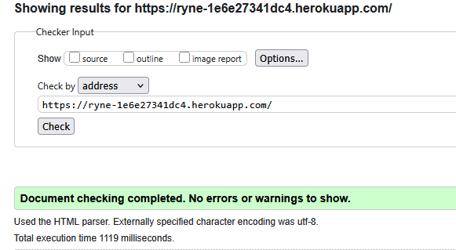
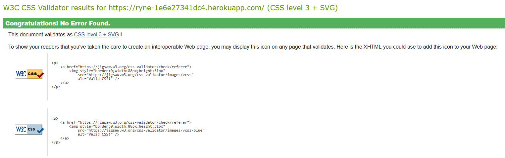
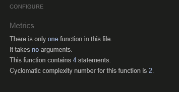
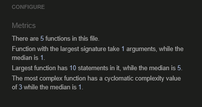

# **Manual Testing**

## **Table of Contents**

* [**Manual Testing**](#manual-testing)
    * [**Bugs and Fixes During the Development Process**](#bugs-and-fixes-during-the-development-process)
    * [**Testing(post development phase)**](#testingpost-development-phase)
        * [**Validation**](#validation)
            * [**HTML**](#html)
            * [**CSS**](#css)
            * [**JavaScript**](#javascript)
            * [**Python - PEP8 - using pycodestyle**](#python---pep8---using-pycodestyle)
        * [**Lighthouse Scores**](#lighthouse-scores)

## **Bugs and Fixes During the Development Process**

Below is a list of bugs and fixes found while creating a feature:

* Issue - Was not receiving emails for signup, successful order etc.
* Cause - Did not have the correct email for the "EMAIL_HOST_USER" in the config variables on heroku.
* Solution - Changed the email to the correct one to send out emails.

* Issue - Product images would not load correctly on the site, when uploaded an image for a new product it would also not displaying.
* Cause - I had a typo in my config variables for "AWS_SECRET_ACCESS_KEY", i had 3 C's instead of 2.
* Solution - Corrected the typ with the correct spelling.

* Issue - On my products page the Category icon didnt display properly and would send you to a products page with "Category=None" instead of the correct categories.
* Cause - I was using "models.ManyToManyField" so products could have multiple categories and i didnt adjust the rest of the code to accomodate this.
* Solution - I had to adjust code in "products.html" so the code would loop through the categories.

* Issue - My custom 404.html page was not displaying when it needed to.
* Cause - I was trying to figure it out looking deeper than i needed, it was displaying a "Internal Server Error (500)" because i did not have a favicon that was overriding the 404 page from displaying.
* Solution - Added a custom favicon to the site and it was resolve my 404.html page from not displaying.

* Issue - Order confirmation email was not sending.
* Cause - I accidently changed the wrong email.txt file when i was trying to setup email verification and this lead to an error being displaying because i was using {{ order.username }} instead of {{ order.full_name }}.
* Solution - I changed the email.txt file back to the original.

* Issue -  Delivery price was incorrect.
* Cause - I was using "STANDARD_DELIVERY_PERCENTAGE = 10" in my settings.py which made the delivery cost super high.
* Solution - Changed my settings.py to "STANDARD_DELIVERY_CHARGE = 3.99" and adjusted models.py and contexts.py to display the correct delivery price at all times.

* Issue - Delivery price was constantly being displaying in the shopping bags even when items had not been added
* Cause - I was using the wrong code in base.html 
* Solution - Adjusted  to 

## **Testing(post development phase)**

### **Validation**

#### **[HTML](https://validator.w3.org)**

No errors were found within my HTML.

#### **[CSS](https://jigsaw.w3.org/css-validator/)**

No errors were found within my CSS.

#### **[JavaScript](https://jshint.com/)**

Checking my static JS files with jshint, there were no issues.

#### **Python - PEP8 - using pycodestyle**

I used pycodestyle to check my python code. pycodestyle is a command line installed with pip. I ran the command "pycodestyle --first <-appname->". This command checks all files in the directories and subdirectories of the app and returns the first error found. With this and cross-checking in the terminal of VScode, I found the only errors were some lines being too long(E501) and expecting 2 blank lines(E302).